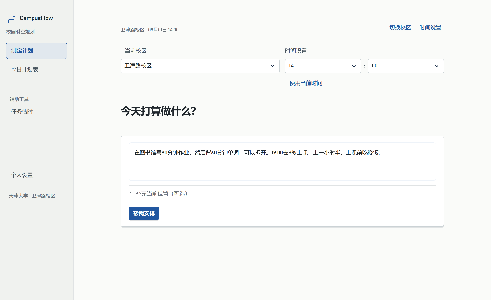

# CampusFlow

**面向天津大学学生的校园时空规划助手。**

CampusFlow 希望帮天大学生解决一个常见的问题：**今天剩下的时间，怎么安排才不乱？**

用自然语言说明今天的任务、课程和要求，它把工作、课程、活动、用餐与天大校园通勤放进同一份可执行的计划。首页聚焦当前行动，完整安排在「今日计划表」中查看；做慢了、提前完成了或临时换了地点，再根据实际状态重新安排。

> 下午在图书馆，晚上 19:00 上课。想先写作业、背单词，还要在课前吃晚饭。
>
> 需要决定的不只是任务顺序，还包括每段做多久、什么时候停下来，以及何时出发才能按时到教室。

## 从一句话，到完整今日计划

1. **制定计划。** 选择校区与参考时间，输入今天想做的事。已保存的课表可以提供固定课程；必要时间或地点不明确时，在当前问题下直接补充。
2. **看当前行动。** 先知道现在做什么、做到几点，再看下一固定安排和移动准备提醒。等待、准备移动与待确认也在同一张行动卡中呈现。
3. **跟着实际情况更新。** 在「有变化？告诉 CampusFlow」中报告进度、位置或临时变化。只想比较一种可能时，先做 What-if 预演，再决定是否采用。

### 制定计划

[](docs/assets/readme/current/plan-input.png)

### 当前行动

[](docs/assets/readme/current/current-action.png)

### 今日计划表

[](docs/assets/readme/current/today-plan.png)

以上及下方截图均来自当前正式页面组件，以隔离的示例数据走现有交互流程生成。图片为 100% 浏览器缩放、双倍像素截图，点击可查看原图；用于展示界面，不作为模型理解能力的评测证据。

### campusflow产品亮点

### 利用高德地图路网，精准规划通勤时间

地点之间的路会占用一天。CampusFlow 使用天津大学**北洋园、卫津路**两校区的本地地点与路网数据，按步行或骑行计算路径、距离和预计用时，并为出发、到达及课前准备留出时间。

固定课程、截止时间、用户指定顺序与不可拆任务共同约束可用窗口。首页只给必要的行动提醒，详细过程保留在计划表中。路网以高德地图与校园资料为基础，经本地整理校准；它不是实时交通服务。

### 后续与计划不一致？重新安排剩余任务

固定承诺保持约束，临时插入、地点变化和时长调整可以进入后续安排。What-if 在隔离状态里预演，只有明确采用才替换当前计划。并行也需要用户明确授权到具体任务和固定安排，再通过窗口、地点及工作量校验；不会因为两个事项看起来简单就自动重叠。

步行或骑行、学习节奏、用餐地点偏好和常用地点可以保存。课表支持手动编辑，以及**文字或截图导入 → 检查预览 → 确认保存**，不依赖教务系统自动同步。

### 任务时间难以估计？上传材料，campusflow帮你估

「任务估时」接受**文字、图片、DOCX 和 PDF**。用户可以补充“前两部分已完成”“计算比较慢”“证明材料已准备好”等实际情况，得到识别范围、建议分钟、用时区间与工作量依据。

[](docs/assets/readme/current/task-estimate.png)

用户明确填写的分钟与 AI 估时保留不同来源。可以补充信息后重新估时，也可以手动修改采用分钟，再加入计划。只识别到部分内容时，页面保留范围提示；外部审批等等待不会直接当作专注工作时间。

## 比普通待办列表更加智能

一段任务放得下，不代表整份计划能执行：任务结束后可能还要走到食堂，吃完再去教学楼；固定课程不能被挤走，已经完成的工作不能在更新后重新出现，预演也不能改掉正式计划。

CampusFlow 的核心设计是 **LLM-led, program-guarded：模型理解意图与工作量，程序计算并校验可执行性。**

| 设计 | 它守住什么 |
| --- | --- |
| 校园路径与时间窗口 | 路线、移动预留、固定承诺与截止共同参与安排，而不是事后附一段路线说明。 |
| 稳定引用（stable refs）与进度台账 | 任务改名、跨轮补充和重规划仍指向同一对象；计划分配不写成实际完成。 |
| What-if 隔离与原子发布 | 预演不污染当前状态；采用前核对基线，校验或保存失败保留原合法方案。 |
| 材料事实与来源引用 | 任务范围、数量所属对象及「约」「至少」「区间」等限定词有正式结构与来源；估时和呈现不能随意改写。 |
| 正式校验与有界恢复 | schema、证据、算术及 policy 持续生效；修复次数有限，失败后给出安全结果或清楚的失败状态。 |
| 本地持久化 | SQLite 按个人档案保存任务、实际进度、计划、偏好与课表；事务和版本检查防止半更新或旧状态覆盖。 |

### 材料理解与估时分工

Recognition 负责「是什么任务、范围与证据在哪里」，独立 Estimation 负责「需要多久」。TJU 材料识别的正式结构通道使用 Function Calling：

```text
共享正式声明
  ├─ 阶段字段投影 → nullable object 的 anyOf 兼容 → 剥离 annotation → tool schema
  └─ 字段与枚举的业务含义 → prompt-side semantic guide

tool arguments → 标准 JSON 解析 → 正式 parser / validators
               → actionability / evidence refs / source support
               → 独立估时 → ledger / policy / 算术校验 → 呈现与采用
```

兼容层只改变 schema 向接口的表达方式，不放宽业务模型。schema 注释移到提示侧，避免端点将描述误生成为实例字段；normal 与 repair 共用声明。root/item 的历史估时字段保留读取兼容，但不再邀请 Recognition 生成。

旧 content 通道保留兼容能力，结构修复、估时修复与必要的序列化恢复均有次数上限。非法枚举、未知来源和未经验证的调整不能因为经过 repair 就跳过校验。

技术栈：**Python · Streamlit · SQLite · Requests · pypdfium2 · defusedxml · pytest**。依赖版本见 [requirements.txt](requirements.txt)，详细职责见 [DESIGN.md](DESIGN.md) 与 [Function Calling Recognition](docs/function-calling-recognition.md)。

## 本地运行

### Windows

安装 64 位 **Python 3.12**，下载并完整解压当前源码到可写目录，双击 [启动 CampusFlow.bat](启动%20CampusFlow.bat)。中文入口无法打开时可用 `start_campusflow.bat`。

启动器创建项目独立虚拟环境、安装依赖并打开浏览器。首次在页面配置 TJU 服务地址、模型名称与 API Key；也可先跳过查看界面。后续在「个人设置 → 我的偏好 → TJU 模型服务」修改。使用期间保留启动窗口，按 Ctrl+C 结束服务。

### 手动启动

```powershell
python -m venv .venv
.venv/Scripts/python.exe -m pip install -r requirements.txt
.venv/Scripts/python.exe -m streamlit run src/p2_live_main.py --server.address=127.0.0.1
```

其他平台使用对应虚拟环境的 Python 路径。开发者也可以复制 [.env.example](.env.example) 为 `.env`，填写分配到的服务配置；真实模型调用需要有效账号与相应网络访问条件。不要将密钥写入任务文本或提交到仓库。

个人档案与模型配置分开保存在本机。`CAMPUSFLOW_DATA_DIR` 可指定档案目录，Windows 默认使用 `%LOCALAPPDATA%/CampusFlow`。匿名模式仅保留当前会话；本地档案身份不是学校统一身份认证。

[详细启动与故障处理](docs/local_quickstart.md) · [模型服务配置](docs/llm_providers.md) · [隔离演示指南](docs/demo_guide.md)

## 验证与当前边界

自动测试覆盖任务身份、进度、路线与截止、What-if、原子采用、估时 ledger、材料保真、课表及档案隔离。测试使用 fake/mock 与临时档案，不依赖真实用户数据。

真实评测另行记录，**单阶段 fixture、完整流程、定向回归和重复抽样分别统计**。例如最近的 [多轮与材料稳定性报告](docs/evaluation/2026-09-17-multiturn-reliability.md) 中，Recognition 100 例最终业务 gold 为 **98/100**；20 份材料初始完整流程为 **12/20**，含安全 fallback，不能理解为所有材料都能一次成功。更完整的样本、失败分类与成本见报告。

当前保存的是 **pre-semantic-simplification baseline**，不是最终语义稳定版。[独立产品验收](docs/evaluation/2026-09-19-product-reasonableness.md) 的跨迭代收口证据为技术39/40、产品33/40；仍有7个明确失败，涉及虚构时序、截止识别、多操作反馈、返程地点、旧标题与动作依赖。自动测试通过不能代替这些用户视角结论。

复现自动检查：

```powershell
.venv/Scripts/python.exe -m pytest tests -q
.venv/Scripts/python.exe -m compileall -q src tests scripts
git diff --check
```

当前正式范围：

- **材料容量：** 图片单张 ≤5MB；DOCX/PDF ≤10MB；提取文字与材料补充合计 ≤12,000 字符；PDF ≤20 页。超限明确提示，不静默截断。复杂材料仍可能需要补充、修复或安全降级。
- **校园范围：** 两校区分别规划，不提供跨校区交通，也不掌握实时路况、排队与教室占用。
- **使用环境：** 主要面向本地、可信环境使用。课表导入需要用户检查；模型识别和估时存在不确定性，硬事实不明确时保留确认门禁。

## 继续了解

- [技术设计](DESIGN.md) · [工作量估时](docs/workload_estimation.md) · [材料处理边界](docs/file_material_delivery.md)
- [校园地图覆盖](docs/weijinlu_map_coverage.md) · [扩展可靠性评测](docs/evaluation/2026-09-17-reliability.md) · [多轮与材料稳定性](docs/evaluation/2026-09-17-multiturn-reliability.md)


