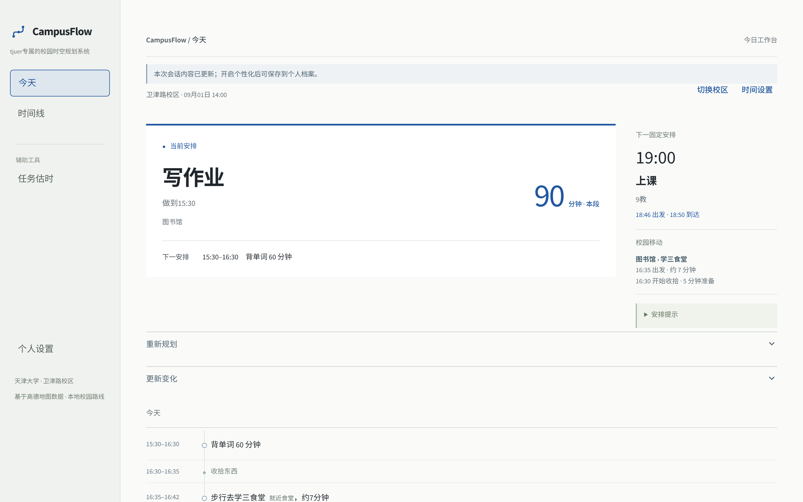
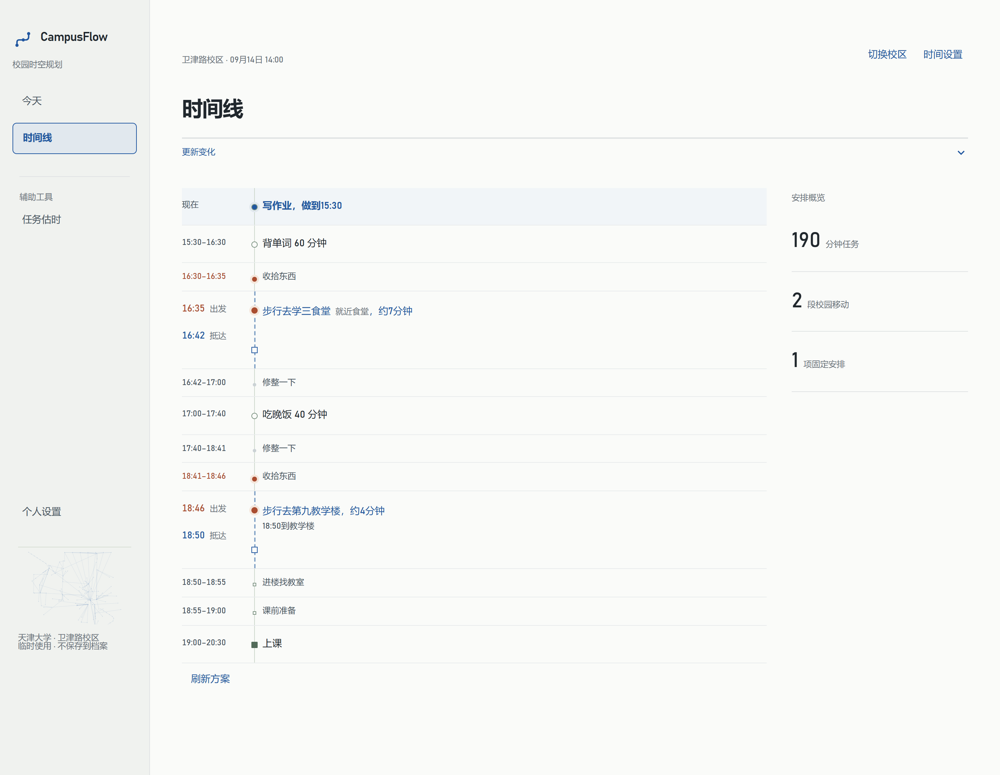
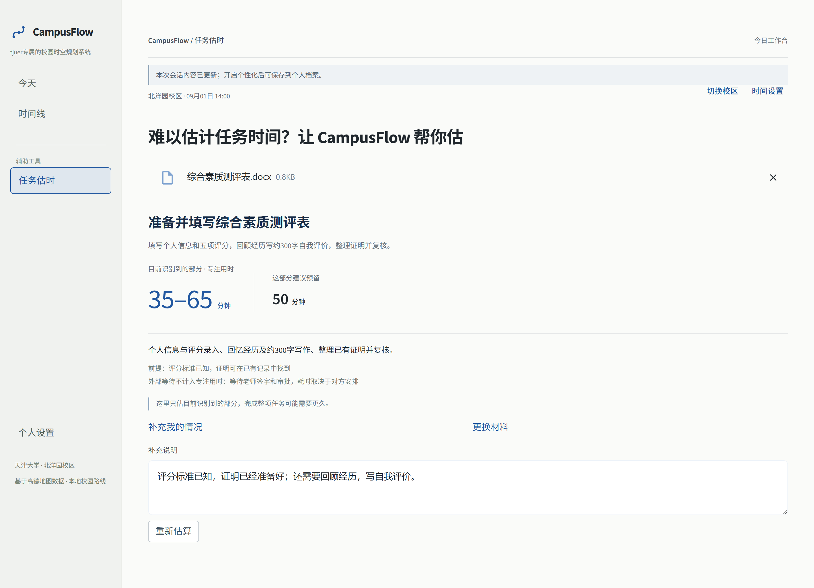
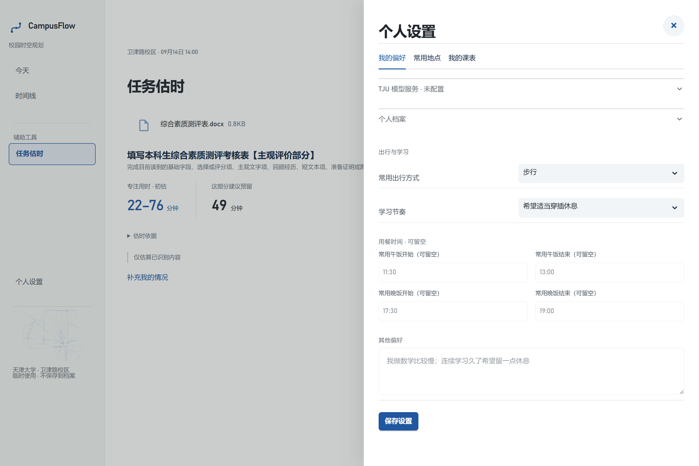
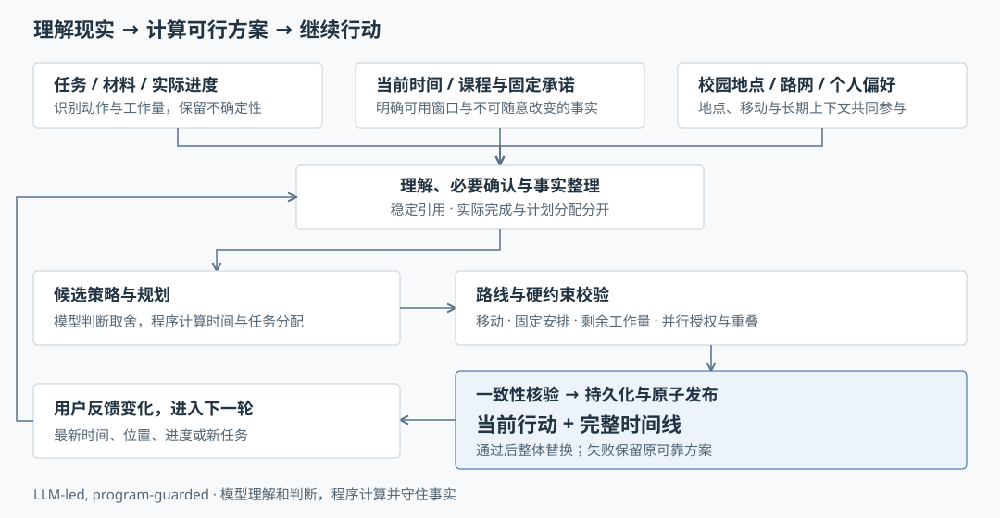

# CampusFlow

**tjuer专属的校园时空规划系统**

把任务、课程、吃饭和校园移动放进同一条现实时间轴，回答：**我现在这段时间最值得做什么？**

> 14:00，在卫津路图书馆。19:00 去 9 教上课。
> 课前想吃饭，还有作业和单词没完成。
>
> CampusFlow 安排现在做什么、做到几点，并算出什么时候收拾、出发和到达。
> 做慢了、提前完成了，或人已经换了地方，都可以从最新状态继续规划。

[](docs/assets/readme/today.png)

点击截图可查看原尺寸。[前端冻结记录](docs/FRONTEND_FREEZE.md)。

## CampusFlow 有什么不同

### 01 地点之间的路，也占用一天的时间

**基于高德地图数据构建并本地化天津大学北洋园、卫津路校园路网。**
开发阶段采集、校准校园地点与道路信息，把教学楼、食堂、宿舍及其连接关系带入规划。
选定校区和出行方式后，程序计算路径与移动时间；地点不再只是任务旁边的一段文字。

同样是“19:00 上课”，下面这份安排会留下完整的过程：
18:41 收拾东西 → 18:46 从食堂出发 → 18:50 到教学楼 → 找教室、课前准备 → 19:00 上课。
前面的学习和用餐必须给这段过程留出时间。

**路线本身就是计划的一部分。** 学习、吃饭、空档、移动与固定课程出现在同一条连续时间线上。

[](docs/assets/readme/timeline.png)

### 02 现实变了，接下来的计划也能变

作业做慢了、提前完成了、当前地点变化，或临时多了一件事，原来的时间表就需要重新判断。

在“更新变化”中补充实际情况，例如“作业还剩 40 分钟，我现在在图书馆”。
CampusFlow 根据**最新进度、当前时间与地点、剩余任务和固定安排**重新计算后续方案，保留已经完成的工作。
课程等固定承诺继续约束可用时间，路线也随新的安排计算。

如果只是想比较另一种安排，可以先做 **What-if 预演**：查看变化后的候选方案，确认采用后才替换当前计划。
计划不是一次生成的静态结果；用户反馈让它接着现实继续往下走。

### 03 不知道要多久，先把任务材料交进来

待办工具通常需要用户自己填写时长，但用户恰恰可能不知道一份作业、申请表或评价表要花多久。

“任务估时”接受**文字、图片、Word / DOCX、PDF**。作业、试卷、通知、申请表、评价表和任务说明可以直接输入，
无需先整理成完整任务。还可以补充自己的实际情况：

- “前两题已经完成。”
- “计算比较慢，这部分不熟，需要翻笔记。”
- “证明已经准备好，还需要回顾经历、写自我评价。”

**同一份材料，对不同人的工作量并不相同。** CampusFlow 结合任务内容与个人情况，给出预计专注时间区间、建议用于规划的分钟数、工作量依据和必要假设。
时间花在填写、做题、主观文字、回忆、查资料、准备证明和复核上；外部签字、审批等待不计入专注用时。

[](docs/assets/readme/task-estimate.png)

完整任务还没整理好，也可以先得到已识别工作量的估时。部分识别会明确标注范围，说明整项任务可能更久。
估时可以修改；**确认任务及必要信息后才加入计划**，不会因为上传了一份材料就自动写入正式安排。

### 04 能表达合法并行，也保留独占时间

现实中有些事项允许同时推进，CampusFlow 不把所有安排都强制串行。但当前支持的粒度很明确：
**用户明确授权，指定某个任务在某项固定安排内推进一段时间。**

模型理解并行请求，程序核对任务与固定安排的稳定引用、地点兼容性、可用时间窗口及剩余工作量。
超出窗口、地点冲突、授权不明确或会重复占用工作量的组合不能直接进入计划；并行分配也不能互相重叠。

“低注意力”或“可拆分”标签本身不等于授权。需要完整注意力的安排不应授权并行；未获明确授权的固定时间保持独占。
这是一种受约束的执行语义，不是任意多个任务自动叠加，也不把安排过的并行分钟当成已经完成。

### 05 设置一次，以后少输入

个人设置保存的是后续规划会继续使用的上下文，而不只是显示偏好。

- **步行 / 骑行**：影响所用校园路径与移动时间。
- **学习节奏**：为适当穿插休息、减少任务切换等取舍提供长期偏好。
- **午饭 / 晚饭时间**：作为用餐窗口参与后续安排。
- **常用地点、常用学习地点**：让“回宿舍”“去常用学习地点”有明确目的地，减少重复输入。
- **其他个人偏好**：自由填写，为后续规划和估时提供参考。
- **个人课表**：生成当天有效的固定课程承诺。

课表支持手动编辑，也支持文字或**截图导入 → 识别 → 用户检查预览、选择和编辑 → 确认保存**。
它不是教务系统自动同步。本次明确要求优先于长期默认；常用目的地也不会被当成用户的当前位置。

[](docs/assets/readme/settings.png)

## 一天是怎样被安排的

1. **说清今天的事。** 输入任务和时间要求；已保存的课表提供固定课程。需要通勤而位置未知时，再确认当前位置。
2. **补齐影响安排的信息。** 不知道任务时长，先估工作量；课程、截止或地点有关键歧义时，保留待确认项。
3. **先看当前行动，再看完整时间线。** 上面的示例先安排图书馆写作业，同时给出晚饭、出发、到楼与上课时间。
4. **用实际进度继续更新。** 到 15:30 作业仍剩 40 分钟，就反馈这项变化；重新判断剩余时间如何分配，而不是把原计划里的 90 分钟记成已完成。

校园路网让移动进入计划，动态更新让计划跟上现实，估时补足未知工作量；合法并行和长期偏好进一步表达一个学生真实的一天。

## 为什么不只是 Todo 或日历

待办和日历很适合记录事项与约定。CampusFlow 更关注这些事项在现实中如何接起来。

| 关注点 | 记录型 Todo / 日历的常见用法 | CampusFlow |
| --- | --- | --- |
| 地点 | 标记地点、查看约定 | 校园路径与移动时间进入计划 |
| 变化 | 编辑事项、手动移动时间 | 根据最新进度、时间和地点继续规划 |
| 时长 | 用户填写预计用时 | 从材料与个人情况估计工作量 |
| 并行 | 记录重叠事项 | 明确授权后，校验可执行的并行分配 |
| 个性化 | 管理分类与提醒 | 偏好、课表和常用地点参与规划 |

这里比较的是使用侧重点，并不意味着其他产品都不具备扩展能力。

## CampusFlow 如何工作

核心思路是 **LLM-led, program-guarded：模型理解和判断，程序计算并守住事实。**

大模型负责自然语言理解、任务语义、工作量判断、候选策略和解释。
程序负责时间事实、校园路径与移动用时、任务状态、稳定引用、实际进度，以及方案发布前的硬约束校验。



候选方案需要经过可行时间窗口、任务分配、校园路线和固定承诺等检查，表达也要与同一候选的事实一致。
通过校验并完成必要持久化后，才发布匹配的当前行动、移动安排和完整时间线。

**工作量估计是一条独立能力。** 材料读取后先保存可识别的工作量，再为这部分工作确定用时；正式任务结构整理失败不会抹掉合法工作量。
主理解缺少合法估时但已有工作量时，允许一次严格有界的 estimate-only 短调用；仍失败则按已识别的字段、题目、文字、查阅等特征计算保守区间。
不按文件大小或页数直接计时，不用统一的“默认 60 分钟”。不可读、纯参考或无法判断动作的材料才需要进一步澄清。

路网数据在本地参与路径和移动时间计算。地点数据以高德地图为基础，并结合天津大学校园资料校准、保留来源与近似标记；
寻路按步行、骑行可用道路分别计算，无法可靠定位或连通时保留不可用状态。详见[技术设计](DESIGN.md)与[校园地图覆盖记录](docs/weijinlu_map_coverage.md)。

## 关键工程设计：防止计划在多轮使用中失真

**计划 ≠ 完成。** `TaskProgress` 分开记录计划分配与实际完成。更新方案、恢复档案、安排并行任务，都不会把“准备做”变成“已经做完”。

**Stable refs。** 任务和固定承诺使用稳定引用。多轮补充、改名、调整与并行授权仍指向同一对象，避免只凭名称猜错任务。

**What-if 隔离预演。** 候选在隔离状态中构建，预演不污染当前计划。采用时核对原状态与设置的基线；基线已变化的旧预演不能直接覆盖新状态。

**原子发布。** 新方案的任务、进度、路线和展示事实作为同一批次提交。校验或保存失败保留原可靠方案，避免页面出现半份旧计划、半份新计划。采用预演时发布已经看过的候选，不重新调用模型另做一份。

**硬事实与软偏好分开。** 固定课程时间、地点约束、剩余工作量需要程序守住；默认饭点和学习节奏作为偏好参与取舍，不能压过明确承诺。

**有界调用。** 理解、决策、表达和修正各有边界，不通过无界 Agent 循环反复尝试。材料流程最坏为一次主理解、一次识别修正、一次短估时；编辑设置、恢复档案不触发隐藏模型调用。

**按用户隔离的本地持久化。** SQLite 保存结构化任务、实际进度、计划、设置、课表及相关草稿，使用事务和版本检查防止旧会话覆盖新记录。
匿名模式只保留当前会话；开启个性化后可选择档案、下次继续使用。原始上传文件、模型密钥和完整请求不会作为个人档案内容保存。

## 快速开始

### Windows 推荐方式

1. 安装 **64 位 Python 3.12**，勾选 **Add python.exe to PATH**。已有 Python 3.8–3.12 可用，3.9.7 除外。
2. 在 GitHub Releases 下载 `CampusFlow-v1.0.0-rc1-windows.zip`，完整解压到可写文件夹。
3. 双击 **[启动 CampusFlow.bat](启动%20CampusFlow.bat)**；中文入口无法打开时使用 `start_campusflow.bat`。
4. 首次在页面连接 TJU 模型服务并保存配置。
5. 输入今天的安排，开始使用。

首次创建项目独立的 `.venv` 并安装依赖，然后启动页面、自动打开浏览器。后续核对依赖版本，匹配时跳过重复安装。
重复启动会打开已运行的页面；如果仍在准备，会提示查看原启动窗口，不会再开一份服务。

使用期间保留启动窗口，按 Ctrl+C 或关闭该窗口结束服务。首次打开在页面填写 TJU 服务的 API 地址、模型名称和 API Key，保存后即可使用，无需手动创建 `.env`。也可以暂时跳过，先查看页面。
默认北洋园校区，当前位置按需确认，不必先填完个人资料。

### 手动启动

以下为 Windows PowerShell 命令；其他平台使用对应虚拟环境的 Python 路径。

```powershell
python -m venv .venv
.venv\Scripts\python.exe -m pip install -r requirements.txt
.venv\Scripts\python.exe -m streamlit run src/p2_live_main.py --server.address=127.0.0.1
```

[详细启动、退出与故障处理](docs/local_quickstart.md) · [无需真实模型的演示排练](docs/demo_guide.md)

## 模型与网络配置

Windows 本地用户在首次页面连接 TJU 模型服务，以后可在「个人设置 → 我的偏好 → TJU 模型服务」修改。页面配置保存在本机用户目录，换目录解压升级后仍可使用。保存不发起网络请求，可另行主动测试连接。

开发者或手动部署也可将 [.env.example](.env.example) 复制为 `.env`。下面均为占位内容：

```dotenv
TJU_LLM_BASE_URL=<学校提供的接口地址>
TJU_LLM_MODEL=<学校提供的模型标识>
TJU_LLM_API_KEY=<你的服务密钥>
```

接口地址、模型与权限以当前服务账号为准。真实模型调用需要相应 TJU 账号和校园网 / VPN 等网络条件。

本地默认仍使用 TJU。公网受限试用可在 Streamlit Secrets 中显式设置
`CAMPUSFLOW_LLM_PROVIDER="deepseek"`，文字和图片共用现有产品流程。配置、当前模型名称与
最小真实验收见[模型服务配置](docs/llm_providers.md)及[Cloud Secrets 模板](deploy/streamlit-community.secrets.toml.example)。
页面保存立即生效；手动修改 `.env` 后重启。进程环境变量优先于 `.env`，两者优先于页面保存的本机配置。不要提交或分享 `.env`、`model-service.json`，也不要将密钥填入任务、课表或偏好文本。

`CAMPUSFLOW_DATA_DIR` 可指定档案目录；本地使用可留空，Windows 默认使用 `%LOCALAPPDATA%\CampusFlow`。
模型配置与个人档案分开，复制源码不会自动迁移个人数据。

## 技术栈与项目结构

Python 3.8–3.12 · Streamlit 1.31.1 · SQLite · Requests · pypdfium2 · defusedxml · pytest。
依赖版本以 [requirements.txt](requirements.txt) 为准；模型通过统一接口接入 TJU / DeepSeek。

- `src/p2_live_main.py`：正式 Streamlit 入口，组织今天、时间线、任务估时与个人设置。
- `src/`：任务状态、决策与执行、路线校验、独立工作量、课表和本地持久化。
- `data/`：北洋园与卫津路校园地点、道路和来源记录。
- `scripts/`：Windows 启动引导、隔离演示与开发验证工具。
- `tests/`：模型替身、状态与流程回归、路线和文档边界测试。
- `docs/`、[DESIGN.md](DESIGN.md)：技术设计、专题实现与验收记录。

## 测试与质量

最近一次全量记录为 **2026-09-12：2441 passed，0 failed**（包含 Cloud 最小兼容测试）。
2026-09-13 发布准备另跑入口、配置与 TZ 相关离线回归，**99 passed**；业务代码未变化，未重复运行全量。
测试覆盖规划与反馈、并行授权、稳定引用、What-if、原子采用、工作量估计、材料确认、课表、设置与档案隔离等；
另执行 Python 编译检查和 `git diff --check`。

自动测试使用 fake/mock 模型，阻断真实 HTTP 与真实配置文件读取，并使用独立临时档案。
Windows 复现全量测试可使用系统临时目录，避免把测试档案放入源码目录：

```powershell
$testRoot = Join-Path $env:TEMP ("campusflow-tests-" + [guid]::NewGuid().ToString("N"))
.venv\Scripts\python.exe -m pytest -q --basetemp=$testRoot
.venv\Scripts\python.exe -m compileall -q src tests scripts
git diff --check
```

本文四张界面图重新截自当前正式页面组件，以隔离演示数据走现有交互流程；使用 1440 CSS 像素宽、100% 缩放、双倍像素 PNG 原图。
它们展示产品状态和交互，不作为真实模型识别准确率的证据。本次未调用真实 TJU API；真实服务与真实材料质量需要另行验收。

## 当前边界

- 主要面向电脑端本地 Web 使用；两校区分别计算校园路径，目前不规划跨校区交通，也不掌握实时交通、排队或教室占用。
- 复杂文档或图片可能只能识别部分内容，估时按实际覆盖范围表达，用户可以补充、修改和确认。
- 并行需要指定任务与固定安排的明确授权及程序校验，不能任意叠加需要完整注意力的事项。
- 本地学号映射用于选择个人档案，**不是天津大学统一身份认证**；当前档案入口适合本机或可信使用环境。

## 相关文档

- [技术设计](DESIGN.md)：模型、程序事实与发布职责。
- [独立工作量估时](docs/workload_estimation.md)：识别范围、短调用与保守估算。
- [Word / PDF 处理边界](docs/file_material_delivery.md)：格式、大小与页数限制。
- [任务材料确认](docs/material_inbox_delivery.md)：草稿、确认与正式任务的连接。
- [校园地图覆盖记录](docs/weijinlu_map_coverage.md)：数据来源、地点与连通性核对。
- [演示指南](docs/demo_guide.md)：校园场景与隔离排练方式。
- [首次公开快照与 Cloud 部署步骤](docs/public_snapshot_release.md)：保留开发历史，独立导出公开仓库。
- [变更记录](CHANGELOG.md) · [比赛交付清单](docs/competition_release_checklist.md)。
