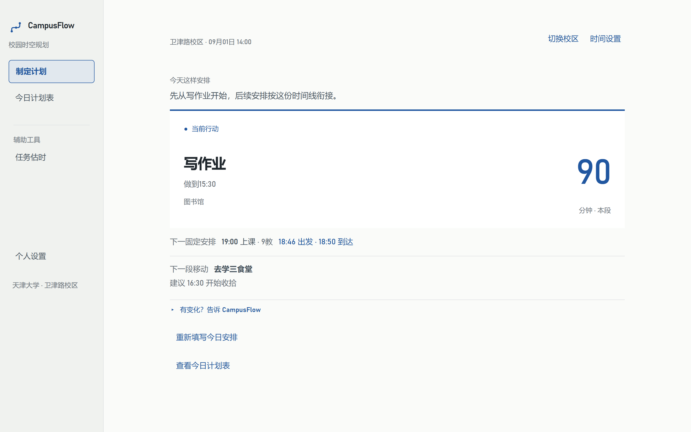
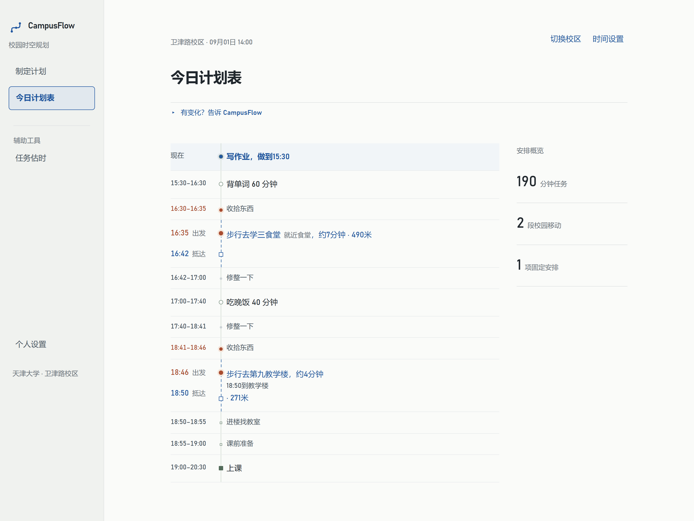
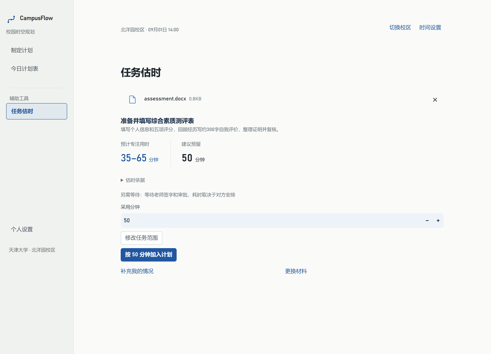

# CampusFlow

**有状态的校园时空规划 Agent 原型。** 面向天津大学北洋园、卫津路两校区。

CampusFlow 尝试回答：**我现在该做什么、做到几点、什么时候该出发，以及现实变化后，计划怎样继续成立。**

用自然语言说出任务、课程和要求，它将工作量、固定承诺、截止时间与校园移动放进同一份计划。首页聚焦当前行动；做慢了、提前完成了、换了地点，就从实际状态继续安排。

[](docs/assets/readme/current/current-action.png)

## 从今天的想法，到眼前这一步

1. **说出今天的安排。** 选择校区与参考时间，输入任务。课程、地点等必要事实不明确时，直接在当前问题下补充。
2. **先看当前行动。** 做什么、做到几点，等待还是准备移动，在同一张卡片中呈现；完整安排放在「今日计划表」。
3. **让计划跟着现实变化。** 报告实际进度、位置或临时变化；想比较另一种安排时，先做 What-if 预演，再决定是否采用。

例如：“我现在在诚园7斋，下午四点到六点在46教学楼有课，Java还要学90分钟，课后想吃饭。”

这不只是给待办事项排序：课前学习要给移动与准备留出时间，剩余工作可以接到课后，重新安排不能把“计划过”当成“完成了”。


## 三个核心体验

### 让校园移动真正占用日程

两校区的本地校园图提供地点、路径、距离及步行／骑行预计用时。课程、deadline、出发、到楼和课前准备共同约束任务窗口；不是排完任务后再附一句“记得赶路”。

[](docs/assets/readme/current/today-plan.png)

路网基于高德地图与校园资料整理，运行时本地计算；不提供实时导航或跨校区交通。学习节奏、用餐偏好、常用地点和课表可保存，课表支持文字／截图导入后人工检查与确认。

### 更新的是同一天、同一批任务

“Java做了20分钟”“洗衣服取消，临时买水10分钟”“课程换到另一栋楼”，都需要延续任务身份、实际进度与已确认事实。What-if 使用隔离候选，采用前核对当前状态；失败保留旧合法方案。

并行有明确边界：普通任务与固定安排的并行需要授权和校验；可自主运行的后台过程则表达为**启动 → 运行 → 依赖完成的后续动作**。运行期间可安排兼容的前台任务，但两个需要持续主动操作的任务不能因此任意重叠。

### 不知道多久，先从材料估工作量

「任务估时」接受**文本、图片、DOCX、PDF**，识别任务范围、要求与来源，给出建议分钟和用时区间。可以补充“前两部分已完成”“计算较慢”等个人情况重估，或手动修改采用分钟后加入计划。

[](docs/assets/readme/current/task-estimate.png)

用户明确分钟与 AI 估时保留不同来源；仅识别部分内容时保留范围提示。外部审批等待与专注工作量分开表达。

三张截图来自正式页面组件与隔离示例数据，采用正常浏览器缩放、双倍像素截图，点击查看高清原图。截图展示交互，不充当真实模型准确率证据。

## 工程设计：LLM-led, program-guarded

**模型理解意图、关系与工作量，程序保存事实、计算时间与路线、校验发布条件。**

```text
自然语言 / 材料 / 执行反馈
    → 结构化任务、来源与关系
    → 候选安排 + 时间窗口 / 路线计算
    → 正式约束校验 + 用户可见表达
    → 事务保存与原子发布
```

| 关键设计 | 解决的问题 |
| --- | --- |
| `task_ref` / `commitment_ref` | 改名、反馈、重规划仍指向同一对象；取消和完成状态不因重生成丢失。 |
| planned / completed / remaining | 安排的分钟不计作实际完成；剩余工作量由正式状态延续。 |
| 路线、deadline 与固定承诺 guard | 移动真实占时、固定课程不被挤走、不可拆任务不被强行切碎。 |
| What-if 隔离 + atomic publish | 预演不改正式计划，采用时核对版本，失败不产生半更新。 |
| Function Calling + parser / validator | 材料 Recognition 返回工具参数，仍经过标准 JSON、正式模型、可执行性及来源验证。 |
| provenance + 估时 ledger | 数量、范围和限定词保留来源；工作量、调整、算术与呈现交叉校验。 |
| bounded repair / fallback | 修复有次数预算，不能无限换通道撞模型；失败保留安全结果或清楚的失败状态。 |
| SQLite 本地持久化 | 按本地档案保存任务、进度、计划、偏好和课表，模型凭据单独配置。 |

Recognition 与 Estimation 分工：前者识别“做什么、依据在哪”，后者估“多久”。tool schema 与语义说明从共享声明派生；nullable object 兼容和注释剥离只作用于传输层，正常与修复共用契约，不放宽正式校验。

技术栈：**Python · Streamlit · SQLite · Requests · pypdfium2 · pytest**。详见 [技术设计](DESIGN.md) 与 [Recognition 结构通道](docs/function-calling-recognition.md)。

## 本地运行

### Windows

1. 安装 64 位 **Python 3.12**，clone 或完整解压源码到可写目录。
2. 双击 [启动 CampusFlow.bat](启动%20CampusFlow.bat)，或 `start_campusflow.bat`。启动器创建独立环境并安装依赖。
3. 首次在页面配置自己的 TJU 服务地址、模型与 API Key；可以先跳过查看界面。可选 provider 的配置见 [模型服务说明](docs/llm_providers.md)。
4. 使用期间保留启动窗口，按 Ctrl+C 结束服务。

```powershell
git clone https://github.com/naimidcorvalaan/campusflow.git
cd campusflow
python -m venv .venv
.venv/Scripts/python.exe -m pip install -r requirements.txt
.venv/Scripts/python.exe -m streamlit run src/p2_live_main.py --server.address=127.0.0.1
```

其他平台使用相应虚拟环境的 Python 路径。开发者可参考 [.env.example](.env.example)；仓库不附带模型账号或密钥。

本地档案默认位于 Windows `%LOCALAPPDATA%/CampusFlow`，可用 `CAMPUSFLOW_DATA_DIR` 指定目录。匿名模式只保留当前会话。本地档案不是学校统一身份认证。[启动与故障处理](docs/local_quickstart.md)

已有 `v1.0.0-rc1` Release 保留作历史版本；**本 README 展示当前 main 源码，请使用源码体验本页界面与能力。**

## 验证与边界

当前源码基线通过 **3,858 项自动测试**，覆盖身份、进度、并行、移动、截止、材料事实、估时和状态隔离。真实场景验证另行区分单阶段、完整流程和重复抽样；技术通过不等于用户视角合理。见 [公开验证摘要](docs/validation.md)。

```powershell
.venv/Scripts/python.exe -m pytest tests -q
.venv/Scripts/python.exe -m compileall -q src tests scripts
git diff --check
```

这是一个 **engineering prototype**，不是生产服务。复杂自然语言和材料理解仍有概率性，个别摘要措辞可能与正确时间线不一致；最终40＋40产品验收尚未全部完成。

正式材料范围：图片单张 ≤5MB，DOCX/PDF ≤10MB，PDF ≤20页，提取文字与材料补充合计 ≤12,000字符。超限明确提示，不静默截断。模型护栏降低错误风险，不承诺任意输入、任意文件都能正确处理。
